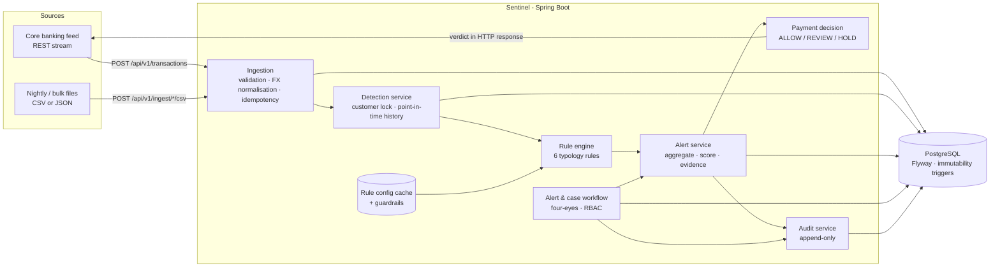
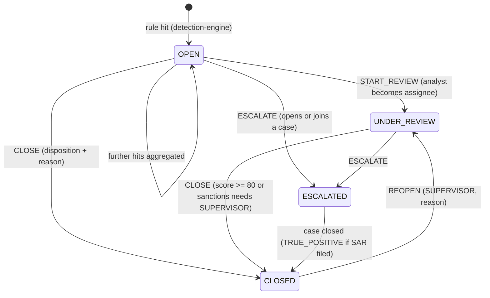

# Sentinel AML – Real-Time Transaction Monitoring

Transaction monitoring system (TMS) prototype for **MeridianTrust Bank**. It ingests customer, account and transaction
data, runs configurable anti-money-laundering (AML) rules on every transaction, and raises risk-scored alerts that
explain themselves. Analysts then work those alerts through an audited alert/case workflow. In the words of the Chief
Compliance Officer (CCO):

> *"Reliably catch known laundering typologies, explain WHY it flagged something, and give my analysts a clean workflow."*

On top of the required business rules there is a set of **loss-prevention guardrails**:
- a real-time ALLOW/REVIEW/HOLD verdict for each payment
- fail-closed behaviour when detection breaks
- an automatic account freeze on a sanctions hit
- four-eyes closure of high-risk alerts
- regulatory floors on rule tuning
- FX fat-finger protection
- self-healing re-evaluation of anything left unchecked

Demo


| | |
|---|---|
| **Stack** | Java 21 · Spring Boot 3.3 (Web, Data JPA, Security, Validation) · PostgreSQL 16 · Flyway · springdoc-openapi · Maven · Docker |
| **Frontend** | React 19 · TypeScript · Vite · Tailwind · TanStack Query/Table/Virtual · Zustand · React Flow · Recharts · STOMP/SockJS. See [section 17](#17-frontend-analyst-workbench) |
| **Verified** | 77 unit tests (JUnit 5 + Mockito) · 37/37 end-to-end checks ([`scripts/smoke_test.py`](scripts/smoke_test.py)) |
| **Bulk performance** | **12,596 transactions ingested + evaluated in 24 s** (detection 18.2 s ≈ 690 txn/s, 8 threads). Target: < 2 min |
| **Streaming latency** | **~18 ms** server-side per transaction (≤ 160 ms round trip). Target: < 1 s |
| **Concurrency** | 40 parallel streams for one customer → exactly **1** alert, **40/40** transactions on it as evidence |

---

## Contents
1. [Quick start](#1-quick-start)
2. [Architecture](#2-architecture)
3. [Business rules → code → tests](#3-business-rules--code--tests)
4. [Detection engine design](#4-detection-engine-design)
5. [Guardrails against financial loss](#5-guardrails-against-financial-loss)
6. [Rule configuration approach](#6-rule-configuration-approach)
7. [Alert and case workflow](#7-alert-and-case-workflow)
8. [Security, RBAC and PII](#8-security-rbac-and-pii)
9. [Concurrency and consistency](#9-concurrency-and-consistency)
10. [Non-functional requirements checklist](#10-non-functional-requirements-checklist)
11. [API overview](#11-api-overview)
12. [Seed data](#12-seed-data)
13. [Demo walkthrough](#13-demo-walkthrough)
14. [Project structure](#14-project-structure)
15. [Trade-offs and what I would do next](#15-trade-offs-and-what-i-would-do-next)
16. [Interview Q&A cheat-sheet](#16-interview-qa-cheat-sheet)
17. [Frontend (analyst workbench)](#17-frontend-analyst-workbench)
18. [Frontend and backend mapping, known gaps](#18-frontend-and-backend-mapping-known-gaps)

---

## 1. Quick start

Prerequisites: Docker Desktop and Python 3 (for the helper scripts). No local JDK or Maven is needed: the build
runs inside the Maven container.

```bash
cp .env.example .env              # then set real passwords; .env is git-ignored
docker compose up -d --build      # postgres + backend (Flyway migrates on start)
./scripts/load-seed.sh            # customers -> accounts -> 12.6k transactions (+ bulk detection) -> malformed-row demo
python scripts/smoke_test.py      # 37 end-to-end checks of every rule, NFR and guardrail
```

- Swagger UI: <http://localhost:8080/swagger-ui.html> (click **Authorize**, then use a user from `.env`)
- OpenAPI spec: [`docs/openapi.json`](docs/openapi.json), also live at `/v3/api-docs`
- Health: <http://localhost:8080/actuator/health>

Run the unit tests (inside Docker):

```bash
cd backend
docker run --rm -v sentinel-m2:/root/.m2 -v "$PWD":/app -w /app maven:3.9-eclipse-temurin-21 mvn -B test
```

Reset everything: `docker compose down -v`.

### Run the analyst UI

Three options. A and B need Node 20.19+ or 22+; C (Docker) needs nothing extra.

```bash
# A) Demo mode: no backend needed, runs on the bundled CSV data
cd frontend && npm install && npm run dev            # http://localhost:5173

# B) Live mode against the backend started above
#    1. in frontend/.env set: VITE_API_MODE=live, BACKEND_USER, BACKEND_PASSWORD, VITE_API_USER (same as BACKEND_USER)
#    2. restart the dev server so it re-reads .env
cd frontend && npm run dev

# C) Everything in Docker (UI on http://localhost:3000)
#    put base64 of "admin:<password>" in .env as FRONTEND_BASIC_AUTH, then:
docker compose up -d --build
```

The UI has no sign-in screen; the proxy authenticates as a service account. Full details, the demo script and the
troubleshooting table are in [section 17](#17-frontend-analyst-workbench).

---

## 2. Architecture



**Layering.** The code has a controller → service → repository layout inside each feature package (`ingestion`,
`detection`, `alert`, `casemgmt`, `customer`, `reference`, `audit`, `dashboard`).
- **Controllers:** handle HTTP, validation and role checks only.
- **Services:** hold the business logic and transaction boundaries.
- **Repositories:** JPA for aggregates and JDBC for the hot and bulk paths.
- **Rules:** pure functions over a `RuleContext`, so they unit-test without Spring or a database.

**Why JPA *and* JDBC?** JPA handles entity lifecycles (alerts, cases, rule config) where optimistic locking and dirty
checking pay off. JDBC handles bulk inserts (multi-row `INSERT … ON CONFLICT … RETURNING`) and the windowed history
queries that run thousands of times per batch. Using the right tool for each access pattern is how the bulk target is
met.

---

## 3. Business rules → code → tests

| # | Business rule | Where it is implemented | Proven by |
|---|---|---|---|
| 1 | Single txn ≥ USD 10,000 (currency-adjusted) is flagged | [`CtrThresholdRule`](backend/src/main/java/com/meridian/sentinel/detection/rules/CtrThresholdRule.java): the threshold is converted to INR through the FX table | `CtrThresholdRuleTest` (exact boundary, INR equivalent, just-below) |
| 2 | ≥ 3 txns on one account in 24 h, each USD 9,000–9,999 → Structuring | [`StructuringRule`](backend/src/main/java/com/meridian/sentinel/detection/rules/StructuringRule.java) | `StructuringRuleTest` (window edge, band edges, per-account scope, INR accounts) |
| 3 | Deposit and ≥ 80 % moved out within 48 h → Rapid Movement | [`RapidMovementRule`](backend/src/main/java/com/meridian/sentinel/detection/rules/RapidMovementRule.java): evaluated on the outgoing leg; only debits after the first credit count | `RapidMovementRuleTest` |
| 4 | Watch-listed counterparty / jurisdiction always alerts, any amount | [`HighRiskJurisdictionRule`](backend/src/main/java/com/meridian/sentinel/detection/rules/HighRiskJurisdictionRule.java) + `watchlist_entry` table (admin API) | `HighRiskJurisdictionRuleTest` (INR 1 payment still alerts) |
| 5 | Daily value/volume > 3× the 90-day rolling average → Behavioural Deviation | [`BehavioralDeviationRule`](backend/src/main/java/com/meridian/sentinel/detection/rules/BehavioralDeviationRule.java): business day in IST; also catches dormant-account reactivation | `BehavioralDeviationRuleTest` (value, count, time zone, cold start, dormant) |
| + | Round-number patterns (typology from the brief) | [`RoundAmountRule`](backend/src/main/java/com/meridian/sentinel/detection/rules/RoundAmountRule.java) | `RoundAmountRuleTest` |
| 6 | Alerts never silently deleted; disposition reason and analyst kept | No delete endpoint. DB triggers reject `DELETE`/`TRUNCATE` on `alert`. `CLOSE` requires a disposition and reason; `disposed_by` comes from the security context | `AlertServiceTest`; smoke test tries a real SQL `DELETE` and is rejected |
| 7 | Weighted 0–100 risk score, highest risk at the top of the queue | [`RiskScorer`](backend/src/main/java/com/meridian/sentinel/detection/RiskScorer.java); `GET /alerts` defaults to `sort=riskScore,desc` (indexed) | `RiskScorerTest`, `AlertAggregatorTest` |
| 8 | PII masked in list views, full only in detail views for authorised roles | [`PiiMasker`](backend/src/main/java/com/meridian/sentinel/common/PiiMasker.java) and [`PiiAccessService`](backend/src/main/java/com/meridian/sentinel/customer/PiiAccessService.java): lists are always masked; detail views are unmasked only for SUPERVISOR/ADMIN, and every reveal is audited as `PII_VIEWED` | `PiiMaskerTest`; smoke test (analyst vs supervisor) |
| 9 | Amounts normalised to a base currency via a configurable FX table | `exchange_rate` table → `ReferenceDataService.toBase()`; `amount_base` is stored at ingestion; rates can be changed via the API | `ReferenceDataServiceTest` |

**Risk score formula (BR7):**

```
score = Σ weight(rule) × severity(rule)     weight 0–100 from rule_config, severity 0–1 from the rule
      + 10 × (number of distinct rules − 1)  corroboration: independent typologies agreeing
      + KYC uplift                           HIGH +15, MEDIUM +5
      clamped to [1, 100]
```

Severity grows with how strongly the pattern shows. For example, CTR at 1× the threshold scores 0.6 and at 3× scores
1.0; each extra structured deposit adds 0.1. This way a USD 10k property purchase (score ≈ 18) sits far below a
high-risk customer who is structuring, passing funds through and wiring to a sanctioned party (score 100).

---

## 4. Detection engine design

```
DetectionRule<P>  { code(); paramsType(); Optional<RuleHit> evaluate(RuleContext, P) }
RuleContext       = transaction + DetectionHistory (point-in-time) + ReferenceData (FX, watchlist) + business zone
RuleHit           = ruleCode, severity 0..1, evidence txn ids, human-readable explanation with the actual numbers
```

- **Custom engine rather than Drools.** There are six typologies, each needing windowed SQL history. A small typed
  interface is easier to explain, test and audit than a DRL rule base, and every threshold still lives in the database.
  Adding a typology means one Spring bean plus one `rule_config` row.
- **Point-in-time semantics.** History is read "as of" the transaction being evaluated (`occurred_at < t`, or the same
  timestamp with a lower id). A back-dated bulk file and a live stream therefore produce the same alerts.
- **Explainability.** Each hit carries an analyst-ready sentence, for example:
  `[RAPID_MOVEMENT] INR 1,441,291.78 credited in 2 transaction(s) and INR 1,359,192.93 (94.3%) moved out in 3 debit(s) within 30h (rule: >= 80% out within 48h).`
  The alert stores the rule version that fired, so the explanation can be traced to exact thresholds.
- **De-duplication and aggregation.** All hits for a customer inside a 72-hour window fold into the customer's single
  OPEN/UNDER_REVIEW alert.
  - Per rule, the alert keeps the maximum severity and a hit count.
  - The evidence window only widens.
  - The score is recomputed after each fold.
  - Evidence rows are idempotent (`ON CONFLICT DO NOTHING`).
  - Result: 40 structuring deposits give **one** alert with 40 evidence transactions, not 40 alerts.
- **Bulk path.** Rows are inserted in chunks of 500 with a single multi-row `INSERT … RETURNING`. They are then grouped
  **by customer** and evaluated on a fixed pool of 8 threads. Each customer's transactions run sequentially in time
  order (consistent behavioural history); different customers run in parallel.
- **Streaming path.** `POST /api/v1/transactions` takes the customer lock, inserts the transaction, runs detection,
  raises or aggregates the alert and decides the verdict, all in **one database transaction**, and returns in ~18 ms.

---

## 5. Guardrails against financial loss

A monitoring system loses money in two ways:
1. **Money leaves before anyone looks:** the brief's "48–72 hours after the fact" problem.
2. **Detection silently stops working:** a bad configuration change, a bad FX rate, a crash mid-batch, or an analyst
   clearing a real case.

Each guardrail below targets one of these.

| Guardrail | What it prevents | How |
|---|---|---|
| **Real-time payment verdict** | Funds leaving before review | Every streamed transaction returns `decision: ALLOW / REVIEW / HOLD` with reasons. HOLD is returned for: a sanctions or high-risk-jurisdiction hit (either direction); an outgoing payment whose alert score ≥ 80; any debit from a frozen account. Core banking holds settlement on HOLD. ([`PaymentDecisionPolicy`](backend/src/main/java/com/meridian/sentinel/detection/PaymentDecisionPolicy.java)) |
| **Automatic account freeze** | Follow-up payments after a sanctions hit | An outgoing payment to a *named* sanctioned counterparty sets the account to `FROZEN` (audited as `ACCOUNT_FROZEN`). Later debits are HOLD. Only a SUPERVISOR can unfreeze, with a mandatory reason (`POST /accounts/{id}/unfreeze`). |
| **Fail closed** | A broken rule letting payments through unchecked | If any rule throws, the other rules still run, the verdict is **HOLD**, and the transaction is **not** marked evaluated. Callers must also treat a non-2xx response as HOLD. |
| **Self-healing re-drive** | Transactions that are never evaluated (crash, restart, degraded rule, `detect=false` loads) | A scheduler re-evaluates anything with `evaluated_at IS NULL` older than 5 minutes. Evaluation is idempotent. The dashboard shows `pending_evaluation`. |
| **Regulatory floors on tuning** | A "noise reduction" change that stops detecting laundering | Admins can make rules **stricter** at runtime but never looser than BR1–5: CTR ≤ USD 10k; structuring band covers 9,000–9,999, count ≤ 3, window ≥ 24 h; rapid ratio ≤ 80 %, window ≥ 48 h; multiplier ≤ 3×; sanctions name match stays on. Mandated rules cannot be disabled or given weight < 10. The API returns 422 `GUARDRAIL_VIOLATION`. If someone edits the table directly, the engine logs an error and **keeps the mandated rule running**. The floors live in code ([`RuleGuardrails`](backend/src/main/java/com/meridian/sentinel/detection/config/RuleGuardrails.java)) so the person who tunes rules cannot move them. |
| **FX fat-finger protection** | USD 0.835 instead of 83.5 shrinking every foreign amount 100× below the CTR threshold | A rate change > 10 % returns 422 `FX_RATE_DEVIATION` unless `confirmLargeChange=true`. The base currency is pinned to 1. Every change is audited. |
| **Four-eyes closure** | One analyst clearing a real laundering case | Alerts with score ≥ 80, and **any** sanctions/high-risk alert, can only be closed by a SUPERVISOR (403 otherwise). Only supervisors can reopen, file a SAR or close a case. |
| **Justified watchlist removal** | Silently whitelisting a sanctioned party | Deactivating a watchlist entry requires a reason (min. 10 characters). Entries are never deleted, and the change is audited. |
| **Immutable records in the DB** | Deleting evidence or rewriting history | DB triggers reject deletes on alerts and evidence, and updates/deletes on the audit log, case notes and rule history. |
| **Money correctness** | Rounding and precision loss | `NUMERIC(19,4)` and `BigDecimal` throughout; amounts must be positive with ≤ 4 decimals. |

All thresholds are in `application.yml` under `sentinel.guardrails` (`hold-score`, `supervisor-close-score`,
`auto-freeze-on-sanctions`, `redrive-after-minutes`).

---

## 6. Rule configuration approach

- Rules live in the **`rule_config`** table: `enabled`, `weight`, and `params` (JSONB: thresholds, windows,
  currencies). The seed values come from `V2__reference_data.sql`.
- **`PATCH /api/v1/rules/{code}`** (ADMIN) merges the new params over the current ones. The whole set is then:
  1. bound to the rule's **typed params record** (unknown keys and wrong types → 422);
  2. checked with **Bean Validation** (e.g. `@Min(2) minCount`);
  3. checked against the **regulatory floors** (Section 5).
- On success the version is bumped, a row is written to `rule_config_history`, the change is audited (with before and
  after values), and the in-memory snapshot is hot-swapped **after commit**. The next transaction uses the new
  settings: no restart, no redeploy.
- Every instance also re-reads the table every 30 s, so a multi-node deployment converges.
- The snapshot is an immutable `Map`, so detection threads never lock on configuration.
- Thresholds are expressed in a reference currency (USD) and converted with the live FX table, so "USD 10,000
  equivalent" stays correct if rates move.

```bash
# make structuring stricter: 2 deposits within 48h
curl -u admin:$PW -X PATCH localhost:8080/api/v1/rules/STRUCTURING \
     -H 'Content-Type: application/json' -d '{"params":{"minCount":2,"windowHours":48}}'
# try to switch it off -> 422 GUARDRAIL_VIOLATION
curl -u admin:$PW -X PATCH localhost:8080/api/v1/rules/STRUCTURING -H 'Content-Type: application/json' -d '{"enabled":false}'
```

---

## 7. Alert and case workflow



A case moves `OPEN → INVESTIGATING → SAR_FILED → CLOSED` (or `OPEN/INVESTIGATING → CLOSED`).
- Filing a SAR (Suspicious Activity Report) and closing a case are SUPERVISOR actions.
- Closing a case closes its escalated alerts with a disposition derived from the outcome.
- Illegal transitions return **409**.
- Every transition is written to `audit_log` with actor, timestamp, from/to state and reason
  (`GET /alerts/{id}/history`, `GET /cases/{id}`, `GET /audit`).

---

## 8. Security, RBAC and PII

| Capability | ANALYST | SUPERVISOR | ADMIN |
|---|:-:|:-:|:-:|
| Alert queue, alert/customer detail (masked), timeline, dashboard | ✔ | ✔ | ✔ |
| Start review, close normal alerts, escalate, work cases, add notes | ✔ | ✔ | ✔ |
| **Full PII** in detail views (audited) | | ✔ | ✔ |
| Close critical/sanctions alerts, reopen alerts, file SAR, close case, unfreeze account, read audit log | | ✔ | ✔ |
| Ingestion, streaming feed, rules / watchlist / FX changes, re-run detection | | | ✔ |

- **No hard-coded secrets.** DB credentials and user passwords come from environment variables (`.env`, git-ignored).
  The app **refuses to start** if a password is missing. Passwords are BCrypt-hashed in memory.
- **RBAC at the API layer, twice.** URL rules in `SecurityConfig`, plus `@PreAuthorize` on every controller (and
  in-service checks for four-eyes). The UI is never the only line of defence.
- **Error responses.** 401/403 are JSON with the same `ApiError` shape as every other error:
  `{timestamp, status, error, code, message, path, fieldErrors}`.
- **Status codes.** 400 validation · 401 · 403 · 404 · 409 illegal transition / duplicate / concurrent edit ·
  422 business-rule violation (guardrail, unknown account, unsupported currency) · 201 on create.
- **Production next step:** replace HTTP Basic with OIDC/JWT (Keycloak/Azure AD) and move secrets to Vault or AWS
  Secrets Manager. The role model stays the same.

---

## 9. Concurrency and consistency

**Requirement:** "thread-safe, concurrent streams, no duplicate or lost alerts." The design:

1. **Per-customer PostgreSQL advisory lock** (`pg_advisory_xact_lock(customerId)`), taken by detection, alert
   aggregation, analyst actions and case operations for that customer.
   - "Find the open alert, then insert or update" can never race.
   - It works **across threads and across application instances** (unlike `synchronized`).
   - Different customers run fully in parallel.
   - The lock is transaction-scoped, so it is released automatically on commit or rollback: no leaked locks.
2. **Atomic streaming.** Insert, detection, alert, evidence, verdict and audit commit in one transaction, so an alert
   can never exist without its transaction, or vice versa.
3. **Idempotency everywhere.**
   - `txn_ref` is unique; a replay returns 409 (stream) or counts as a duplicate (bulk).
   - `evaluated_at` is checked **after** taking the lock, so two workers never evaluate the same transaction twice.
   - Evidence inserts are `ON CONFLICT DO NOTHING`.
4. **Optimistic locking** (`@Version`) on alerts and cases. Two analysts editing the same record get a 409 instead of
   a lost update.
5. **Immutable in-memory snapshots** for rules, FX and watchlist (`volatile` reference swap), so no reader locks are
   needed.

Verified by the smoke test: 40 concurrent requests for one customer (20 client threads) produced exactly one alert
with 40 evidence rows.

---

## 10. Non-functional requirements checklist

| NFR | Status |
|---|---|
| Java 17+, Spring Boot, JPA, Security, Web, Maven | Java 21, Boot 3.3.5, Maven |
| Relational DB + documented schema/ERD + migrations | PostgreSQL 16, Flyway `V1`/`V2`, [`docs/ERD.md`](docs/ERD.md) |
| 10k transactions < 2 min (bulk) | **12,596 in 24 s** |
| Sub-second streaming | **~18 ms** server time |
| Thread-safe, no duplicate/lost alerts | Advisory lock + idempotency (Section 9), verified with 40 parallel streams |
| No hard-coded secrets | Env vars; fails fast if missing |
| RBAC at API layer | URL rules + `@PreAuthorize` + in-service checks |
| Proper HTTP codes, input validation | Bean Validation on every DTO; row-level validation on files |
| Versioned REST, consistent JSON errors, OpenAPI | `/api/v1/**`, `ApiError`, Swagger UI + [`docs/openapi.json`](docs/openapi.json) |
| Immutable audit of every alert/case transition (timestamp + actor) | `audit_log` + DB triggers |
| Layered architecture, JUnit + Mockito rule tests, SLF4J logging | 77 tests; structured `AUDIT` / `GUARDRAIL` log lines |
| No real PII; synthetic seed data | [`seed/`](seed/): fictitious names, random IDs |

---

## 11. API overview

Full contract: Swagger UI. The main endpoints:

| Method & path | Role | Purpose |
|---|---|---|
| `POST /api/v1/ingest/{customers,accounts,transactions}` (JSON) and `…/csv` (multipart) | ADMIN | Bulk load with per-row validation. Returns `{batchId, received, accepted, duplicates, rejected, errors[], detection{…}}` |
| `GET /api/v1/ingest/batches/{batchId}/errors` | ADMIN | Rejected rows and reasons (also stored in `ingestion_error`) |
| `POST /api/v1/transactions` | ADMIN (feed) | Streaming ingestion. **201** with alert info and the **ALLOW/REVIEW/HOLD** verdict |
| `GET /api/v1/alerts?status=&minScore=&ruleCode=&sort=riskScore&direction=desc` | ANALYST | Risk-ordered, PII-masked queue |
| `GET /api/v1/alerts/{id}` · `/history` | ANALYST | Explanation, per-rule details, evidence transactions, customer, audit trail |
| `POST /api/v1/alerts/{id}/actions` | ANALYST | `START_REVIEW`, `CLOSE`, `ESCALATE`, `REOPEN` |
| `POST /api/v1/cases` · `/{id}/transition` · `/{id}/notes` · `/{id}/assign` | ANALYST/SUPERVISOR | Case management |
| `GET /api/v1/customers` · `/{id}` · `/{id}/transactions` | ANALYST | Lookup, detail (role-based PII), transaction timeline with alert refs |
| `GET/PATCH /api/v1/rules/{code}` · `/history` | ANALYST / ADMIN | Runtime tuning with guardrails |
| `GET/POST/PATCH /api/v1/watchlist` · `GET/PUT /api/v1/fx-rates/{ccy}` | ANALYST / ADMIN | Reference data |
| `GET /api/v1/accounts?status=FROZEN` · `POST /{id}/unfreeze` | ANALYST / SUPERVISOR | Guardrail holds |
| `GET /api/v1/dashboard/summary` | ANALYST | Status counts, rule × risk-band heatmap, trend, false-positive rate, time-to-disposition |
| `POST /api/v1/detection/run-pending` | ADMIN | Manual re-drive |

---

## 12. Seed data

The dataset in [`seed/`](seed/) is used **as-is**: `customers.csv` (500), `accounts.csv` (807) and
`transactions.csv` (12,596 over 120 days). It is fully synthetic, with fictitious names and random ID numbers.
[`seed/scenarios.json`](seed/scenarios.json) lists which customers carry which planted typology; the smoke test uses
it to prove each one is caught.

| Typology | Customers | Detected |
|---|---|---|
| Structuring (3–5 cash deposits just under USD 10k in 24 h) | 15 | 15/15 |
| Rapid movement (large inflow, 85–98 % out within hours) | 12 | 12/12 |
| High-risk jurisdiction / sanctioned counterparty | 12 | 12/12 |
| Behavioural deviation (quiet retail customer, one huge day) | 10 | 10/10 |
| Repeated round amounts | 10 | 10/10 |
| Large single transaction (CTR) | 15 | 15/15 |
| Layering ring (all of the above combined, HIGH-risk KYC) → score 100 | 3 | 3/3 |

`transactions_malformed.csv` demonstrates validation. It holds 10 rows: 8 malformed, plus one valid row and its
duplicate. The 9 bad rows (bad enum, negative amount, unknown account, unsupported currency, future timestamp,
unparseable amount, unknown channel, short row, duplicate `txnRef` in the batch) are rejected one by one with reasons;
the valid row still loads.

---

## 13. Demo walkthrough

**Ingestion → detection → alert → case disposition** (about 5 minutes)

1. **Ingest:** `./scripts/load-seed.sh`. Show the batch summary: 12,596 accepted, 194 alerts, ~24 s. Then the
   malformed file: 9 rows rejected, each with a precise reason.
2. **Queue:** Swagger `GET /api/v1/alerts` as the analyst. The top alerts score 100 (layering ring). Names are
   masked (`A**** K******`).
3. **Why:** `GET /api/v1/alerts/{id}`. Show one explanation line per rule with real amounts, the evidence
   transactions and the rule version. As the supervisor, the same call shows full PII, and `GET /audit` shows a
   `PII_VIEWED` entry.
4. **Real time:** post three cash deposits of about INR 7.9 lakh to one account via `POST /api/v1/transactions`. The
   third returns `STRUCTURING` with an alert ref in ~20 ms. Post a INR 1,500 payment to "Blue Lagoon Trading FZE":
   the verdict is `HOLD` and `accountFrozen: true`. Show that the next debit is also HOLD.
5. **Guardrails:**
   - The analyst tries to close a score-100 alert → **403 (four-eyes)**.
   - The admin tries to disable STRUCTURING → **422 `GUARDRAIL_VIOLATION`**.
   - The admin sets USD to 0.835 → **422 `FX_RATE_DEVIATION`**.
6. **Disposition:**
   - The analyst `START_REVIEW`s and `CLOSE`s a low-risk CTR alert as FALSE_POSITIVE with a reason.
   - The analyst `ESCALATE`s the critical one → a case is opened.
   - The supervisor moves the case `INVESTIGATING → SAR_FILED → CLOSED`, which closes the alert as TRUE_POSITIVE.
   - Show `GET /alerts/{id}/history`: the full immutable trail.
7. **Proof:** `python scripts/smoke_test.py` → 37/37.

---

## 14. Project structure

```
backend/
  src/main/java/com/meridian/sentinel/
    config/       SecurityConfig, OpenApiConfig, ExecutorConfig, SentinelProperties
    common/       ApiError, GlobalExceptionHandler, ApiException, PiiMasker, Money, CurrentUser
    ingestion/    IngestionController/Service, RowReader (JSON+CSV → validated rows), *Record DTOs
    detection/    DetectionService, DetectionEngine, BulkDetectionRunner, JdbcDetectionHistory, CustomerLock,
                  RiskScorer, PaymentDecisionPolicy, rules/*, config/ (RuleConfigService, RuleGuardrails)
    alert/        AlertService (aggregate + workflow), AlertAggregator (pure merge logic), AlertQueryService
    casemgmt/     CaseService (state machine), CaseController
    customer/ account/ reference/ audit/ dashboard/
  src/main/resources/db/migration/   V1__schema.sql, V2__reference_data.sql
  src/test/java/...                  rule tests, scorer, aggregator, guardrails, workflow, config, CSV parsing
frontend/ React analyst UI (screens in src/features, API + mock in src/lib/api). Layout in section 17.10
docs/     ERD.md, openapi.json
seed/     customers.csv, accounts.csv, transactions.csv, transactions_malformed.csv, scenarios.json
scripts/  load-seed.sh, smoke_test.py
```

---

## 15. Trade-offs and what I would do next

| Choice made | Alternative | Reasoning |
|---|---|---|
| REST streaming endpoint | Kafka + Spring Cloud Stream | Meets "incremental/streaming" with synchronous verdicts and no extra infrastructure. `IngestionService.ingestOne` is the seam: a Kafka listener would call it, key messages by customer id (to keep per-customer ordering), and send failures to a dead-letter topic. |
| Custom rule engine | Drools | Six typologies with windowed SQL history: typed Java plus DB params is simpler, faster and easier to explain. Drools pays off with hundreds of business-authored rules. |
| Advisory lock per customer | Kafka partition ordering / `SELECT … FOR UPDATE` | Works for both REST and bulk paths and across nodes, with nothing extra to run. With Kafka, partitioning by customer would provide the same serialisation. |
| FX rate fixed at ingestion | Revalue on rate change | Regulatory reporting needs the value at transaction time; history is never rewritten. |
| Behavioural materiality floors (USD 2,500 / 10 txns, 30 days of history) | Pure 3× rule | A pure ratio fires on every small customer's slightly busier day. The floors are configurable and can be set to 0. The 3× multiplier itself is floor-protected. |
| HTTP Basic, in-memory users | OIDC / JWT | Prototype scope; the role model carries over unchanged. |

**Next steps:**
- ~~React analyst UI~~ built (queue, workbench, rules): see [section 17](#17-frontend-analyst-workbench). Still to build in the UI: the risk heatmap and analyst-productivity dashboard (`GET /dashboard/summary` already serves them). Backend gaps that limit live mode are listed in [section 18](#18-frontend-and-backend-mapping-known-gaps).
- Kafka ingestion.
- Maker-checker approval for rule changes.
- ML anomaly score as an additional weighted "rule".
- Cross-customer counterparty network view (the per-case money map already exists in the UI).
- Server-side SAR narrative generation and storage (the UI drafts one client-side from the alert explanations).
- Rule A/B shadow mode, using the existing `rule_config_history`.
- Partitioning `bank_transaction` by month.
- Testcontainers integration tests in CI.

---

## 16. Interview Q&A cheat-sheet

**How do you guarantee no duplicate or lost alerts with concurrent streams?**
A per-customer PostgreSQL advisory lock serialises every read-modify-write on that customer's alerts, across threads
and nodes. Insert, detection and alert commit atomically. `txn_ref` uniqueness and the `evaluated_at` check (made after
taking the lock) make processing idempotent. Evidence inserts are idempotent. Proven with 40 parallel requests → 1
alert, 40 evidence rows.

**Why not `synchronized` or a Java lock?**
It would not work across multiple application instances, and it would not be released on a database rollback. The
advisory lock is transaction-scoped and cluster-wide.

**How did you hit the bulk performance target?**
- One multi-row `INSERT … ON CONFLICT DO NOTHING RETURNING` per 500 rows.
- Detection partitioned by customer across 8 threads.
- Indexed windowed queries `(account_id, occurred_at)` and `(customer_id, occurred_at)`.
- Rule, FX and watchlist data held as immutable in-memory snapshots, so there are no config reads per transaction.

Result: ~690 transactions/s, 12.6k in 24 s end to end.

**How does an alert explain itself?**
Each rule returns a sentence built from the actual numbers and the threshold it crossed. It also returns the evidence
transaction ids and the rule version. The alert stores all of these per rule and orders them by contribution.

**How are rules changed without redeployment, and what stops someone breaking detection?**
Rules are changed through `PATCH /rules/{code}`. The change is validated three times (typed binding, Bean Validation,
regulatory floors), then versioned, audited and hot-swapped after commit. The floors are in code, so an admin can
tighten rules but never loosen them below the business rules or switch off a mandated typology.

**What happens if the detection engine fails?**
- One broken rule does not stop the others.
- The payment verdict becomes HOLD (fail closed).
- The transaction stays unevaluated and the scheduler re-drives it.
- A crash mid-batch is recovered the same way.
- Nothing is ever silently unmonitored; the dashboard shows the pending count.

**How is money protected, not just flagged?**
- A real-time HOLD verdict for sanctions hits and high-risk outgoing payments.
- An automatic account freeze on a sanctioned counterparty.
- Frozen accounts hold every debit.
- Four-eyes closure of critical alerts.
- FX fat-finger protection, so thresholds cannot be dodged by a typo.

**How is BR6 (never delete) enforced?**
There is no delete API. Closing requires a disposition, a reason and the actor's identity. Database triggers reject
`DELETE`/`TRUNCATE` on alerts and evidence, and any update to the audit log, so even a DBA or a bug cannot remove them.
Reopening keeps the previous disposition in the audit trail.

**How is PII handled?**
List endpoints always mask. Detail endpoints unmask only for SUPERVISOR/ADMIN, and each reveal is audited
(`PII_VIEWED`). All seed data is synthetic.

**Why store both `amount` and `amount_base`?**
The original is the legal record. The base amount allows like-for-like comparison across currencies (BR9) and is
frozen at the ingestion-time rate.

**How would you scale this to millions of transactions per day?**
- Kafka ingestion partitioned by customer id, with stateless detection consumers scaled per partition.
- Monthly partitions on `bank_transaction`.
- A read replica for the analyst queries.
- Rolling baselines pre-aggregated into a daily-totals table, instead of scanning 90 days per transaction.
- The rule interface and the alert model stay the same.

---

## 17. Frontend (analyst workbench)

A React single-page app in [`frontend/`](frontend/) that gives analysts the queue → investigation → disposition flow on top of the API above. It runs in two modes: a **demo mode** that needs no backend (seeded from the CSVs in `frontend/src/lib/api/mock/seed/`), and a **live mode** that talks to this Spring Boot service. Both sit behind one TypeScript interface (`SentinelApi`), so no screen knows which is active.

> **Status.** Verified: strict typecheck, production build, and a smoke test over the demo data path (`npm test`, 3 tests: data load, grouping, money graph, deviation chart, SAR draft, four-eyes close rule, rule guardrails). **Not yet exercised:** live mode against a running backend, the frontend Docker image build, and visual QA in a browser. Treat those as the first things to check.

### 17.1 Screens

| Route | Screen | What the analyst does | Main endpoints used |
|---|---|---|---|
| `/alerts` | **Alert triage queue** | Watch the live header (connection status, counters, "new alerts" banner); filter by risk band, typology, assignee, date range and status; expand grouped entities; open an evidence peek; **Assign to me**, **Promote to case**, **Dismiss** | `GET /alerts`, `GET /alerts/{id}`, `POST /alerts/{id}/actions`, `POST /cases` |
| `/cases` | Case list | Pick up an investigation | `GET /cases` |
| `/cases/:id` | **3-pane investigation workbench** | Read the dossier, the plain-language explanation, the money map, the anomalous ledger and the deviation chart; draft the SAR narrative; escalate, request info or close; read the locked audit trail | `GET /cases/{id}`, `GET /customers/{id}`, `GET /customers/{id}/transactions`, `GET /alerts/{id}`, `GET /alerts/{id}/history`, `POST /cases/{id}/transition`, `POST /cases/{id}/notes`, `GET /watchlist` |
| `/rules` | **Rule and typology manager** | Tune Structuring, Rapid movement and the high-risk jurisdiction list; preview the impact; commit | `GET/PATCH /rules`, `GET/POST/PATCH /watchlist` |

**Queue details.**
- The grid is windowed with TanStack Virtual, so a few hundred rows scroll smoothly. Sorting and expansion are TanStack Table.
- *Group by entity* folds alerts for the same customer whose creation times chain within **72 hours** (the same window the backend aggregates on) into one master row: highest score, summed amount, union of typologies. A group's actions apply to every open alert inside it.
- Keyboard: <kbd>↑</kbd>/<kbd>↓</kbd> move, <kbd>→</kbd>/<kbd>←</kbd> expand/collapse, <kbd>Enter</kbd> opens the peek.
- Streamed alerts are only *counted* until the analyst clicks the banner, so rows never jump under the cursor.

**Workbench panes** (fixed height; each pane scrolls on its own):

| Pane | Width | Contents |
|---|---|---|
| Entity dossier | 25 % | Profile, KYC tier, PEP and sanctions tags, tenure, **stated income vs 30-day velocity** meter, linked accounts (those in evidence are highlighted), alerts in the case |
| Evidence and ledger | 50 % | Explainability card · **React Flow money map** (source → intermediary → beneficiary, with fan-in / fan-out / layering badges) · **TanStack ledger** of offending transactions with a "× baseline" column · **Recharts deviation chart** (daily value vs trailing 14-day μ ± 2σ; days above the band turn red) |
| Disposition and audit | 25 % | State-aware action bar · SAR draft (editable, copy, export `.txt`, FinCEN or FIU wording) · notes · **locked, oldest-first audit trail** |

### 17.2 Stack

| Concern | Choice |
|---|---|
| Core | React 19, TypeScript (strict), Vite 8, React Router 7 |
| Styling / UI | Tailwind CSS 4, shadcn-style components on Radix primitives (dialog, popover, select, tabs, tooltip, switch), Lucide icons, Sonner toasts |
| Server state | TanStack Query v5 (caching, polling, mutations) |
| Local UI state | Zustand (filters, keyboard selection, stream status, session) |
| Grids | TanStack Table v8 + TanStack Virtual |
| Graph / charts | `@xyflow/react` (React Flow) and Recharts |
| Real time | `@stomp/stompjs` over `sockjs-client`, topic `/topic/alerts` |

Design notes: a cool "steel paper" light theme and a dark theme (toggle at the bottom of the rail); risk colours are the only saturated colours on screen; Archivo (condensed labels), Public Sans (body) and IBM Plex Mono (all figures). Risk is never conveyed by colour alone: every badge also shows the score and the band name.

### 17.3 Running it

```bash
cd frontend
npm install
npm run dev              # http://localhost:5173 (demo mode, no backend needed)
npm run typecheck
npm test
npm run build            # type-checks, then bundles to frontend/dist
```

**Demo mode** is the default (`VITE_API_MODE=mock`). Use the **Demo persona** switcher at the bottom of the left rail to try Analyst, Supervisor and Admin; the mock enforces the same role rules as the backend.

**Live mode.** Edit `frontend/.env`, restart `npm run dev` (Vite reads env only at start), and have the backend up:

```bash
docker compose up -d postgres backend     # from the repo root
```

**Full stack in Docker.** Put the base64 of `user:password` into the *root* `.env`, then start everything:

```bash
printf '%s' 'admin:<your-admin-password>' | base64      # paste the output as FRONTEND_BASIC_AUTH in .env
docker compose up -d --build                             # UI on http://localhost:3000
```

| Variable | Where | Meaning |
|---|---|---|
| `VITE_API_MODE` | `frontend/.env` | `mock` (default) or `live` |
| `VITE_BACKEND_URL` | `frontend/.env` | Dev-proxy target for `/api` and `/ws` (default `http://localhost:8080`) |
| `BACKEND_USER`, `BACKEND_PASSWORD` | `frontend/.env` | Service account the **dev proxy** authenticates as. Read by `vite.config.ts` only; never bundled into the browser |
| `VITE_API_USER` | `frontend/.env` | Public name of that same account; the UI uses it to recognise "my" alerts. Must equal `BACKEND_USER` |
| `VITE_BASE_CURRENCY` | `frontend/.env` | Display currency for aggregates (default `INR`, matching `sentinel.base-currency`) |
| `VITE_WS_PATH`, `VITE_ALERT_TOPIC` | `frontend/.env` | STOMP endpoint and topic (defaults `/ws`, `/topic/alerts`) |
| `FRONTEND_BASIC_AUTH` | root `.env` | base64 `user:password`; nginx sends it to the backend as HTTP Basic. Should be the same account as `SENTINEL_ADMIN_USER` (that name is passed to the build as `VITE_API_USER`) |

### 17.4 Authentication model (there is no sign-in screen)

The backend uses HTTP Basic with three roles. The UI deliberately has no login form. Instead:
- The **Vite dev proxy** (dev) or **nginx** (Docker) attaches the service account's credentials to every `/api` and `/ws` request. The password never reaches the browser bundle.
- On start the app works out that account's roles by probing, because the backend has no `/me` endpoint: `GET /rules` (any role) confirms connectivity, `GET /audit` succeeding means SUPERVISOR or above, and a non-403 answer from the ADMIN-gated `/detection/**` means ADMIN.
- Buttons the account may not use are disabled with a tooltip (rule editing needs ADMIN; **Escalate to SAR** and **Close case** need SUPERVISOR; closing an alert scoring ≥ 80 or with a sanctions hit needs SUPERVISOR). The server still enforces every one of these; the UI is never the only line of defence.

> **Consequence to be aware of.** Every action is performed, and audited, as the single service account, not as the individual analyst at the keyboard. That is fine for a demo. For production, put the app behind OIDC/SSO and pass the real user identity through (see §15).

### 17.5 Real-time layer

`useAlertStream` opens **one** STOMP-over-SockJS connection for the whole app and subscribes to `/topic/alerts`. The header shows its state: *Live*, *Connecting*, *Reconnecting*, *Polling* or *Offline*. If no broker is reachable (see the gap in §18), the state settles on **Polling** and the queue refreshes every 15 s via TanStack Query, so the screen degrades instead of breaking. When the stream is live, polling slows to 60 s as a safety net. In demo mode a timer raises a fresh alert every 12–25 s so the banner, row flash and grouping can be shown.

### 17.6 What each button does on the backend

| UI action | Backend call | Notes |
|---|---|---|
| **Assign to me** | `POST /alerts/{id}/actions` `{action: START_REVIEW}` | Sets the assignee to the caller and status to `UNDER_REVIEW`; only allowed from `OPEN` |
| **Dismiss (false positive)** | `… {action: CLOSE, disposition: FALSE_POSITIVE, reason}` | Reason (≥ 10 chars) required. Blocked in the dialog for score ≥ 80 or sanctions hits unless the account is a supervisor |
| **Promote to case** | `POST /cases` `{alertIds, title, reason}` | Alerts must belong to one customer; they become `ESCALATED`. For a group, every open alert in it is attached |
| **Start investigation** | `POST /cases/{id}/transition` `{INVESTIGATING}` | |
| **Request info** | `POST /cases/{id}/notes` | Stored as a note prefixed `REQUEST FOR INFORMATION:` (the backend has no dedicated workflow) |
| **Escalate to SAR** | `POST /cases/{id}/notes`, then `POST /cases/{id}/transition` `{SAR_FILED}` | SUPERVISOR. The backend has no SAR store, so the filed narrative is preserved as an immutable case note |
| **Close case** | `POST /cases/{id}/transition` `{CLOSED, disposition, reason}` | SUPERVISOR. Also closes the case's escalated alerts |

### 17.7 Rules screen ↔ rule parameters

| Card | UI fields | Sent to `PATCH /rules/{code}` (or `/watchlist`) |
|---|---|---|
| **Structuring** | Target amount, delta threshold, rolling window (h), minimum transactions | `lowerAmount = target − delta`, `upperAmount = target − 0.01`, `windowHours`, `minCount` |
| **Rapid movement** | In-to-out ratio (0–1), max elapsed time in **minutes** | `outflowRatio`, `windowHours = minutes / 60` (must be whole hours) |
| **High-risk jurisdictions** | Searchable multi-select of ISO 3166-1 alpha-2 codes | Diffed against active `COUNTRY` watchlist entries: new codes `POST /watchlist`, removed codes `PATCH … {active: false}` |

**Preview impact** opens a dry-run modal (today vs after, newly raised, suppressed, critical delta, sample suppressed alerts, and a warning when detections would drop). Nothing changes until **Commit change**. The regulatory floors in §5 are enforced by the server; a breach comes back as a `422 GUARDRAIL_VIOLATION` and is shown in the modal.

### 17.8 Demo data

Customers and accounts come from `frontend/src/lib/api/mock/seed/customers.csv` and `accounts.csv` (parsed at runtime). Those files hold two customers and two accounts, both accounts for `CUST_00001`. `CUST_00002` has none, so **one synthetic account (`ACC_000003`) is added for her and marked as such in the code**. Transactions and alerts are hand-authored on top; ninety days of ordinary spend are generated deterministically from each account's `avg_monthly_txn_count` and the customer's income. All timestamps are relative to "now".

| Alert | Customer | Score | Scene |
|---|---|---|---|
| ALT-100007 | Anika Fernandes | 97 | ₹1.92L SWIFT wire to *Blue Lagoon Trading FZE* (AE), a sanctions-list counterparty. Only a supervisor may close it |
| ALT-100006 | Anika Fernandes | 91 | **Fan-in / fan-out:** 6 senders put ₹1.71L in; 98 % leaves to 4 beneficiaries within hours |
| ALT-100005 | Anika Fernandes | 63 | Behavioural deviation, already `UNDER_REVIEW` (groups with the two above → **×3**) |
| ALT-100001 | Krishna Sharma | 94 | **Structuring → layering → offshore wire:** 4 cash deposits (₹7.62–8.25L) over 36 h at 3 branches, moved savings → NRE, then ₹28.8L SWIFT to *Orion Shell Holdings Ltd* (CY). `ESCALATED` in **CASE-2001** |
| ALT-100002 | Krishna Sharma | 71 | Behavioural deviation, same case (groups with the above → **×2**) |
| ALT-100004 | Krishna Sharma | 52 | ₹9.2L cash deposit (CTR), `OPEN`, five days old |
| ALT-100003 | Krishna Sharma | 44 | Repeated ₹50,000 rent payments, `CLOSED` as a false positive |

### 17.9 Five-minute demo script

1. **Queue** (`/alerts`): point out the live header. Within ~25 s the banner *"1 new alert arrived"* appears; click **Show in queue** and the new row flashes. Expand **Anika ×3** to show grouping.
2. **Explain**: click a row for the evidence peek (plain-language reason, rules, transactions).
3. **Four-eyes**: on Anika's group, click **Dismiss**. The dialog blocks it: score ≥ 80 or a sanctions match needs a supervisor.
4. **Promote**: click **Promote to case**; the workbench opens for the new case.
5. **Investigate** (`/cases` → **CASE-2001**): read the explanation card; on the money map note the **Layering · 3 hops** badge; in the ledger see the ₹8L deposits as many-times-baseline; on the chart see the red bars above the band; open the **SAR draft**, edit a line, **Copy**, **Export**.
6. **Segregation of duties**: switch the persona to **Supervisor**, click **Escalate to SAR**, confirm. Open **Notes** (the filed narrative) and **Audit trail** (locked, oldest first).
7. **Tune** (`/rules`, persona **Admin**): on *Structuring* set minimum transactions to 6 → **Preview impact** shows suppressed alerts → **Commit** is refused with the regulatory-floor message. Then add **CY** to the jurisdictions, preview, commit, and go back to the case: the Cyprus node on the money map is now outlined as a watch-listed jurisdiction.

### 17.10 Frontend layout

```
frontend/
  src/
    features/
      alerts/   AlertsPage, IngestionHeader, AlertFilters, AlertGrid (virtualized), AlertPeek, AlertDialogs, filtering, store
      cases/    CasesPage, CaseWorkbench (3 panes), EntityDossier, ExplainabilityCard, MoneyMap, AnomalousLedger,
                DeviationChart, DispositionPane, SarDraft, AuditTrail, CaseDialogs
      rules/    RulesPage (three cards, country multi-select, dry-run modal)
      auth/     authStore (session bootstrap, role probing, demo persona)
    components/ ui/ (button, dialog, select, popover, tabs, …), layout/AppShell, RiskBadge, ErrorBoundary
    hooks/      useAlerts, useCases, useCaseEvidence, useRules, useAlertStream, useTheme
    lib/
      api/      types.ts (SentinelApi), http.ts + adapters.ts (Spring Boot), mock/ (CSV seed + in-browser backend), simulation.ts
      realtime/ alertStream.ts (STOMP + demo stream)
      risk.ts, grouping.ts, moneyGraph.ts, stats.ts, sar.ts, typology.ts, format.ts, fatf.ts
    types/      domain.ts (UI models), backend.ts (wire DTOs)
  templates/    nginx config template (injects the service credential)
```

Error handling: every workbench pane and every route sits inside an error boundary, so one failing chart does not take down the cockpit; queries show loading skeletons and inline retry panels; a 4xx is never retried automatically.

---

## 18. Frontend and backend mapping, known gaps

### 18.1 How backend data becomes UI models

The UI works against its own domain models (`Alert`, `AlertEvidence`, `AMLTransaction`, …). Only `frontend/src/lib/api/adapters.ts` knows the wire format.

| UI field | Comes from | Note |
|---|---|---|
| `Alert.overallScore`, `severity` | `AlertSummary.riskScore` | Band is **recomputed from the score** with the UI thresholds (see below), not taken from `riskBand` |
| `Alert.kycTier`, `customerRiskScore` | `customerRiskRating` | `LOW → tier 1 / 20`, `MEDIUM → 2 / 50`, `HIGH → 3 / 80`. The backend keeps a category, not a number |
| `Alert.evidence[]` | list: rule codes; detail: `ruleDetails` + evidence transactions | List rows carry typology only; explanations and transaction ids arrive with the detail call |
| `Alert.aggregatedAmount` | Σ `amountBase` of distinct evidence transactions (detail) | The list omits it, so **visible rows** fetch their detail lazily (cached 60 s). Group rows sum their children |
| `AMLTransaction.counterpartyAccountId` | not provided | Live money-map nodes are keyed by counterparty name |
| `AMLTransaction.isFlagged` | timeline `alertRefs` non-empty | |
| `CustomerProfile.isPep`, `statedMonthlyIncome` | not held by the backend | Shown as "not on file"; the income-vs-velocity ratio appears only when income is present (it is in demo mode) |
| `CustomerProfile.onboardedOn` | earliest account `openedOn` | Best available proxy for tenure |
| `CustomerProfile.sanctionsHit` | an alert carries `HIGH_RISK_JURISDICTION` | |

**Risk bands.** The product brief calls for CRITICAL 90–100, so the UI uses CRITICAL ≥ 90, HIGH 70–89, MEDIUM 40–69, LOW < 40, defined once in `frontend/src/lib/risk.ts`. The backend's own `riskBand` and its four-eyes threshold use **80**. The four-eyes rule (score ≥ 80 or sanctions) is mirrored separately in the same file, so the two are independent. Change the constant if you would rather match the backend.

**Live-mode limits.** The queue asks for up to 200 alerts per query (the API maximum). Risk band, date range and multi-typology filters run in the browser over that page.

### 18.2 Backend gaps and the smallest change that closes each

| Gap | Effect today | Suggested backend change |
|---|---|---|
| No WebSocket/STOMP broker | Live mode shows **Polling** (15 s) | Add `spring-boot-starter-websocket`, expose a SockJS endpoint at `/ws`, and publish the `AlertSummary` to `/topic/alerts` from `AlertService.raise`. The UI already subscribes |
| `AlertSummary` has no aggregate amount | One extra `GET /alerts/{id}` per visible row | Add `aggregatedAmount` (Σ distinct evidence `amount_base`) to `SUMMARY_SQL` |
| No `GET /me` | Roles found by probing endpoints | Return `{username, roles}` and drop the probes in `http.ts` |
| No rule simulation | Dry run is a **modelled estimate**, labelled as such | `POST /rules/{code}/simulate` returning `{currentAlerts, projectedAlerts, newlyRaised, suppressed, criticalDelta, samples}`; the UI calls it first and only falls back if it gets a 404/405 |
| No PEP flag or stated income on `customer` | Dossier shows "not on file" | Add both columns and to `CustomerView` |
| Single shared identity | All actions audited as one account | OIDC/JWT with per-user identity (§15) |

### 18.3 Troubleshooting

| Symptom | Likely cause and fix |
|---|---|
| Full-page error: *"The backend rejected the service credentials…"* | Wrong or missing `BACKEND_USER`/`BACKEND_PASSWORD` in `frontend/.env` (restart `npm run dev`), or `FRONTEND_BASIC_AUTH` in Docker |
| *"Cannot reach the Sentinel API"* | Backend not running on port 8080, or `VITE_BACKEND_URL` is wrong |
| Rules page says *"view but not change"* | The service account is not ADMIN. Use the admin credentials |
| **Dismiss** is greyed out with a supervisor notice | The alert scores ≥ 80 or has a sanctions match. Promote it to a case instead, or use a supervisor account |
| Header stays on **Polling** | Expected until the backend exposes `/ws` (§18.2) |
| Amounts show "—" in the live queue | The alert detail call failed for that row; open the row to see the error |
| Blank page after switching env | Vite only reads `.env` at start; stop and rerun `npm run dev` |
