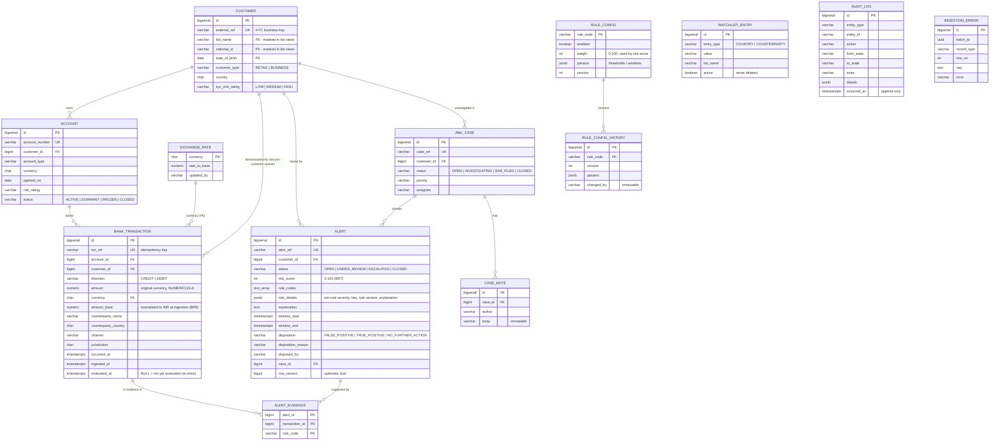

# Sentinel AML – Data model

Source of truth: Flyway migrations in [`backend/src/main/resources/db/migration`](../backend/src/main/resources/db/migration)
(`V1__schema.sql` = structure + immutability triggers, `V2__reference_data.sql` = FX rates, watchlist, rule configuration).

## Design notes

| Decision | Why |
|---|---|
| `amount` **and** `amount_base` stored | Keeps the original record exactly as booked while every rule compares like-for-like in INR (BR9). The rate used is fixed at ingestion time, so later FX edits never rewrite history. |
| `NUMERIC(19,4)` everywhere, `BigDecimal` in Java | No floating-point money. |
| `customer_id` denormalised onto `bank_transaction` | Behavioural and aggregation queries are per customer; avoids a join on the hot path. Indexed `(customer_id, occurred_at)` and `(account_id, occurred_at)`. |
| `txn_ref` unique + `INSERT ... ON CONFLICT DO NOTHING` | Idempotent ingestion: replays from the core-banking feed are counted as duplicates, never double-evaluated. |
| `evaluated_at` + partial index `WHERE evaluated_at IS NULL` | Cheap discovery of transactions that still need detection (crash recovery, degraded rules). |
| `alert_evidence` join table (composite PK) | An alert points at exactly the transactions that prove it; `ON CONFLICT DO NOTHING` makes evidence insertion idempotent. |
| `rule_details` JSONB carries the **rule version** | Every alert can be traced to the exact thresholds that produced it (`rule_config_history`). |
| Triggers `forbid_mutation()` | `DELETE`/`TRUNCATE` on `alert`, `alert_evidence`; `UPDATE`/`DELETE` on `audit_log`, `case_note`, `rule_config_history` raise an error **in the database**, so even a bug or a DBA mistake cannot silently remove an alert or rewrite history (BR6, audit NFR). |
| `row_version` on `alert` / `aml_case` | Optimistic locking: two analysts editing the same record get a 409 instead of a lost update. |
